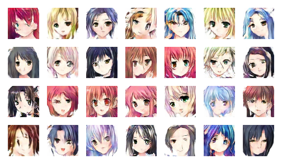
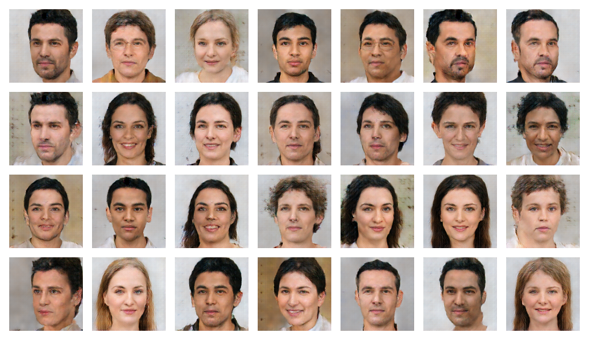

# AlphaGAN
A Stable GAN for 3-Channels Images

## Installation
Use the package manager [pip](https://pip.pypa.io/en/stable/) to install Latest Tensorflow Version.
```bash
pip install tensorflow
```

## Important Parameters
```
SIZE = 32  # 32, 64, 128
SEED = 100  # 100, 200, 300
IMAGE_SHAPE = (SIZE, SIZE, 3)
IMAGES = "/"
IMAGES_PATH = "/"
OUTPUT_PATH = "/"
MODEL_PATH = '/'
BATCH_SIZE = 96
```
## Images
Some of the images produced by AlphaGAN.

## Animes

## Faces



```
Implemented By Muhammad Hanan Asghar
```
